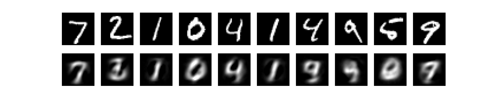
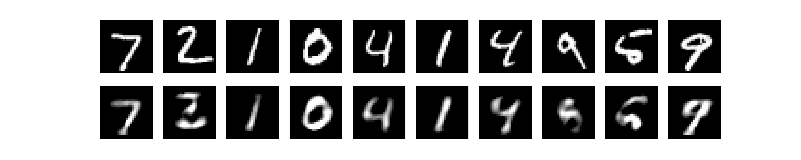
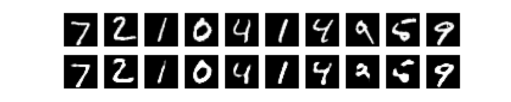
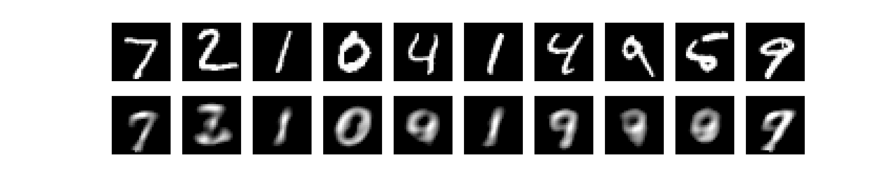
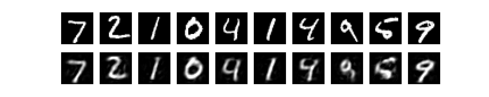
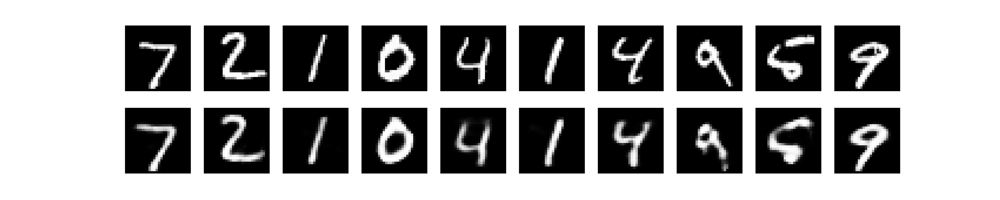
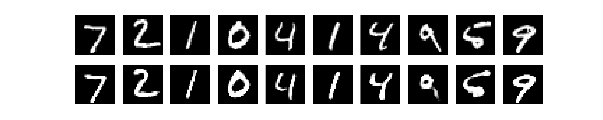
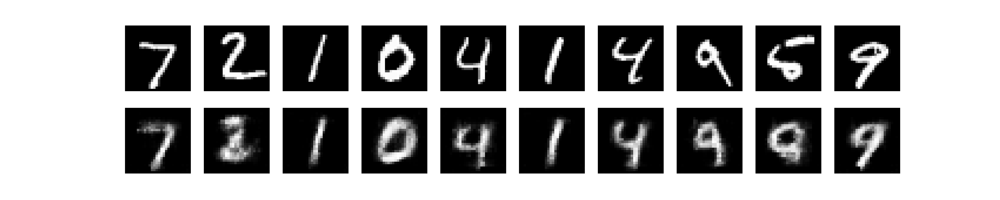

# AE and VAE Playground

**Disclaimer**: VAE coming soon...

#### Remarks

The last activation of the decoder layer seems to be related to the loss used for training and the normalization scheme used on the training data. 

- If the data range is `[-1, 1]`, then a `tanh` activation with an MSE loss does a good reconstruction job.
- If the data range is `[0, 1]`, then a `sigmoid` activation with a binary cross entropy loss does a good reconstruction job.

I assume that the activation function's range is crucial, and that by smartly picking one, we're helping the autoencoder's output more easily match the initial normalization distribution.

#### Simple fully-connected autoencoder (MSE)

 

#### Simple fully-connected autoencoder with `tanh` (MSE)

 

#### Simple fully-connected autoencoder (BCE)

 

#### Simple fully-connected autoencoder with `tanh` and L1 regularization (MSE)

 

#### Stacked 6 layer autoencoder (MSE)

 

#### Stacked 6 layer autoencoder with `tanh` (MSE)

 

#### Stacked 6 layer autoencoder (BCE)

 

#### Convolutional autoencoder with `tanh`

 

### References

- `to_img(x)` function taken from [pytorch-beginner](https://github.com/SherlockLiao/pytorch-beginner/tree/master/08-AutoEncoder).